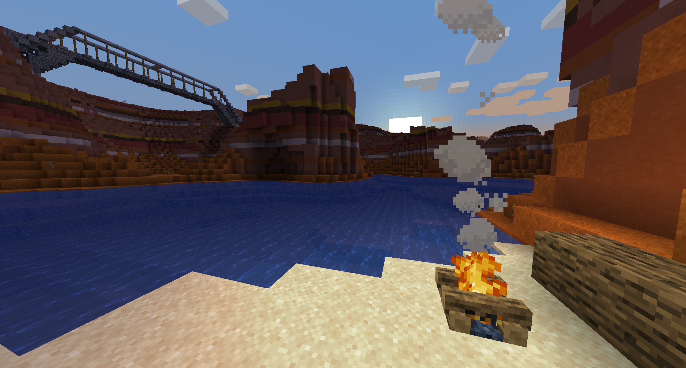
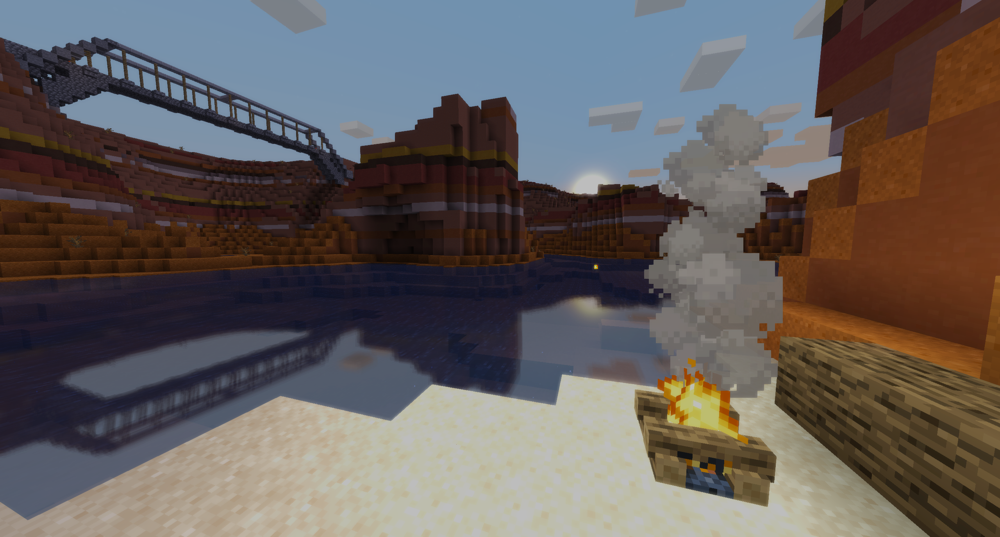

# Basic shaders for vanilla 1.16
- FXAA
- Bloom
- Approximate reflections
- Tonemapping

    <table style="width:100%">
        <tr>
            <td align="middle">
              
              <figcaption align="middle">vanilla</figcaption>
            </td>
            <td align="middle">
               
              <figcaption align="middle">1.16 shader</figcaption>
            </td>
        </tr>
    </table>

