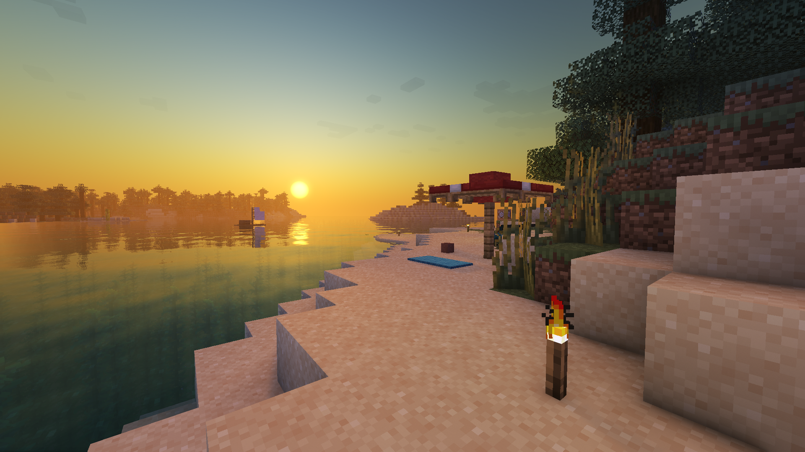

# Basic shaders for vanilla 1.16 DEV BRANCH!!!!!
 

## TIS HOT DEV BRANCH!!! STUFF MAY NOT WORK!!!
CL:
- clean up SSR code and tune parameters
- multi sample SSR! cool reflection blur!!!!!
- pseudo HDR reflections. Sun should now be bright in reflections!
- vertical and sloped relfections support
- view bobbing fix using screen space normals instead
- specular channel
- softer and brighter clouds
- bug fixes

## Overview
Basic shader that adds as much as possible from OptiFine shaders to the vanilla transparency shader available in "Fabulous" graphics setting. Due to limited material, light, time, and shadow information, most advanced features are not possible. A good number, however, are. I have ported them here. Most samples are from the BSL shader, however much of it is heavily modified to fit with the vanilla pipeline. Requires FOV 70 out of the box!

### Features
- FXAA
- Bloom
- Adaptive exposure
- SSR + approximate
- Tonemapping
- Multiplicative transparency blending

### Comparisons

    <table style="width:100%">
        <tr>
            <td align="middle">
              
              <figcaption align="middle">vanilla</figcaption>
            </td>
        </tr>
        <tr>
            <td align="middle">
               
              <figcaption align="middle">shader v1</figcaption>
            </td>
        </tr>
        <tr>
            <td align="middle">
               
              <figcaption align="middle">shader v2</figcaption>
            </td>
        </tr>
    </table>

## Usage
See License.md for licensing. This pack requires FOV 70 with Fabulous graphics on. 
FOV is adjustible from within `resourcepack/assets/minecraft/shaders/post/transparency.json`

## Credits
- **BSL shaders - capttatsu** for reference code for some of the features (SSR, Tonemapping).
