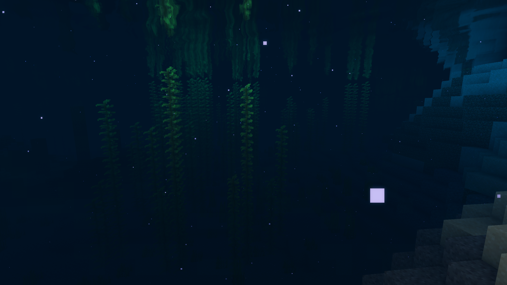
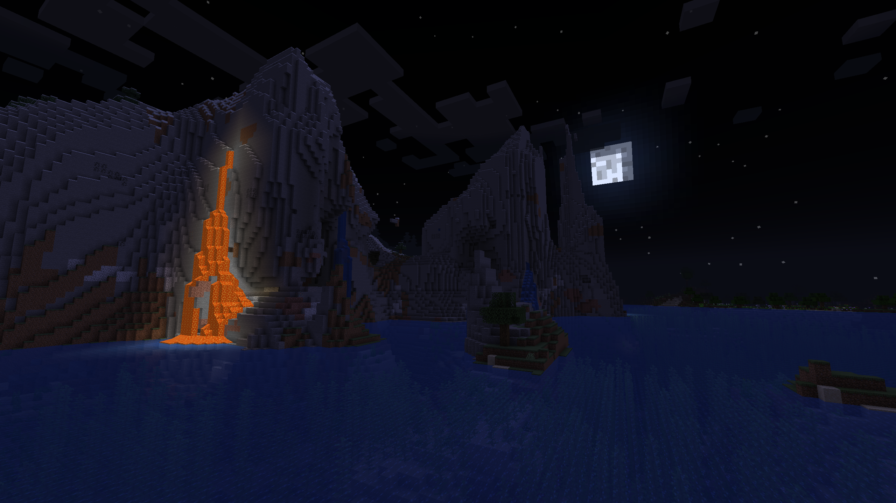

# Better Environment Shaders for vanilla 1.19 (Vanilla Tuning)
 

## Overview
This shader is Better Environment 3.0 tuned to be more vanilla-like.

### Usage
See License.md for licensing. This pack requires Fabulous graphics on. For best experience, use FOV 70 with render distance 16!

### Configuration
Some basic settings can be toggled by editing `assets\minecraft\shaders\post\transparency.json` in `uniforms` for `preprocess0` pass and `postprocess2` pass. The following can be changed:
```
FOVGuess      [30.0, 110.0] 70.0 Default FOV as a fallback
FogDistance   [0.1, 10.0]   3.0  Fog distance multiplier
BloomAmount   [0.0, 1.0]    0.25 Bloom amount to apply
AutoExposure  0.0 or 1.0    1.0  Auto exposure enable
ExposurePoint [1.0, 4.0]    2.0  Target value to expose to  
Vibrance      [0.0, 2.0]    1.0  Color vibrance / saturation
```

## Features
- Water Waves
- SSAO
- SSR
- Revamped Skys: Approximate Atmosphereic Scattering (Overworld), Aurora (End)
- Directional Light
- Screen Space Shadows
- Java Alpha-PBR support (Emissive, Subsurface, Waving)
- Multiplicative Transparency
- HDR Lighting
- Auto Exposure
- Bloom
- Volumetric Clouds
- Compatible with Optifine Fabulous & Dynamic Lights
- Tonemapping

### Comparisons
<div>
    <table style="width:100%">
        <tr>
            <td align="middle">
              
              <figcaption align="middle">vanilla</figcaption>
            </td>
            <td align="middle">
              
              <figcaption align="middle">V-Tune</figcaption>
            </td>
            <td align="middle">
              
              <figcaption align="middle">BENV 3.0</figcaption>
            </td>
        </tr>
        <tr>
            <td align="middle">
              
              <figcaption align="middle">vanilla</figcaption>
            </td>
            <td align="middle">
              
              <figcaption align="middle">V-Tune</figcaption>
            </td>
            <td align="middle">
              
              <figcaption align="middle">BENV 3.0</figcaption>
            </td>
        </tr>
        <tr>
            <td align="middle">
              
              <figcaption align="middle">vanilla</figcaption>
            </td>
            <td align="middle">
              
              <figcaption align="middle">V-Tune</figcaption>
            </td>
            <td align="middle">
              
              <figcaption align="middle">BENV 3.0</figcaption>
            </td>
        </tr>
        <tr>
            <td align="middle">
              
              <figcaption align="middle">vanilla</figcaption>
            </td>
            <td align="middle">
              
              <figcaption align="middle">V-Tune</figcaption>
            </td>
            <td align="middle">
              
              <figcaption align="middle">BENV 3.0</figcaption>
            </td>
        </tr>
    </table>
</div>

## Credits
- **BSL shaders - capttatsu** for base SSR https://bitslablab.com/bslshaders/
- **Auroras - nimitz (twitter: @stormoid)** for base End Auroroa https://www.shadertoy.com/view/XtGGRt
- **Non physical based atmospheric scattering - robobo1221** for base sky https://www.shadertoy.com/view/Ml2cWG
- **Star Spheremap - peremoya2000** for base stars https://www.shadertoy.com/view/styXWz
- **SSAO - reinder** for base AO https://www.shadertoy.com/view/Ms33WB
